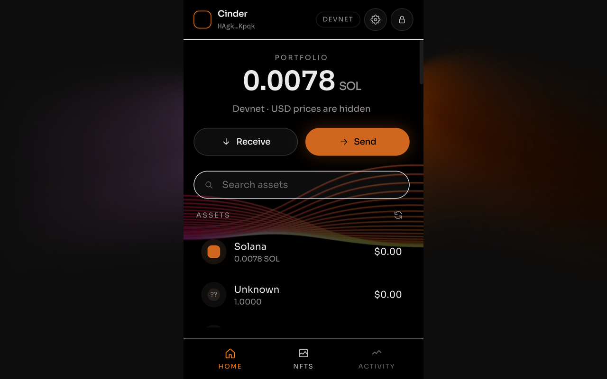
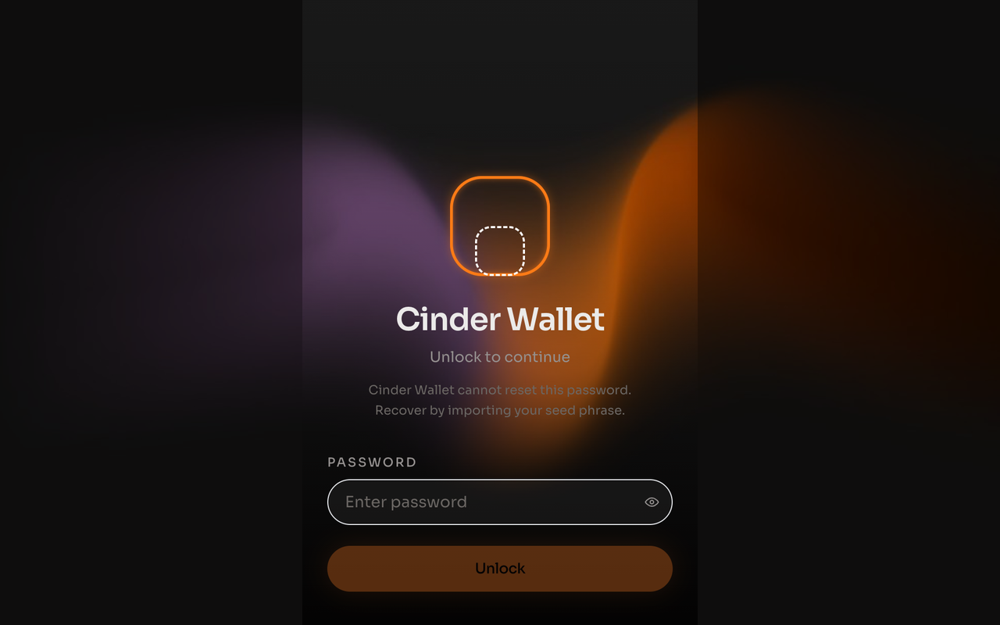
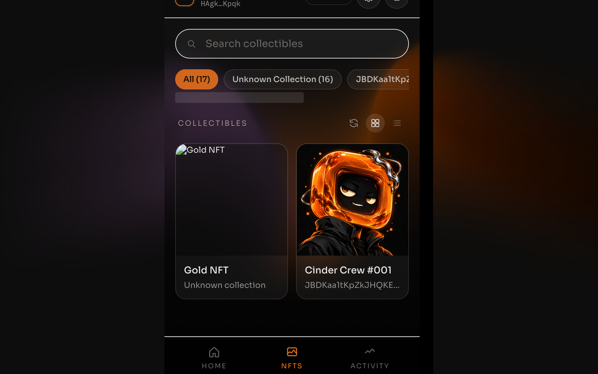
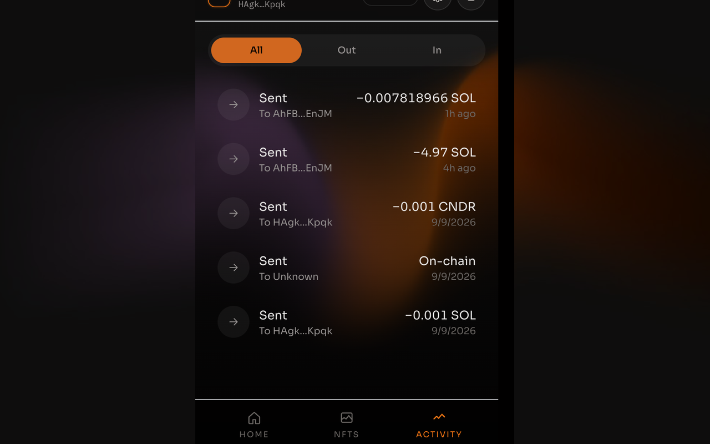

# Cinder Wallet

[](https://github.com/freyja-934/wallet-browser-extension/actions/workflows/check.yml)

Self-custodial Solana wallet for Chrome (Manifest V3). The encrypted keyring lives in the service worker — the popup never holds a `Keypair`. Sites talk [Wallet Standard](https://github.com/wallet-standard/wallet-standard), not a fake `window.solana`.

This is a portfolio implementation. It does not impersonate Phantom. It has not been audited. Do not put mainnet funds on it that you cannot lose.

<p align="center">
  
</p>
<p align="center">
  
  
  
</p>

## What you get, with and without an RPC key

Cinder ships with no API key — a key in a Chrome Web Store zip is a key anyone can extract. The endpoint list comes from Settings, not the build, and what the wallet can show depends on what that endpoint serves.

| | Store build, nothing configured | With your own RPC URL or Helius key in Settings |
|---|---|---|
| SOL balance, send, receive | yes | yes |
| Transaction history | yes (decoded on-chain) | yes, enriched |
| USD prices | yes (CoinGecko) | yes |
| SPL and Token-2022 balances | **no** on Mainnet — `getTokenAccountsByOwner` is refused; yes on Devnet | yes |
| Token names and logos | **no** on Mainnet | yes |
| NFTs | **no** on Mainnet — needs DAS; yes on Devnet | yes |
| dApp connect, sign, simulation preview | yes | yes |

Keyless Mainnet defaults to `https://solana-rpc.publicnode.com`, because `https://api.mainnet-beta.solana.com` returns 403 to any request carrying an `Origin` header — which every extension request does. publicnode accepts browser origins but serves neither token-account queries nor DAS, which is exactly the line in the table above. Devnet's public host serves both, so Devnet is the full-feature demo.

Where a read is not available, the popup says so: tokens and NFTs show "add an RPC endpoint in Settings", a failed read shows an error card with Retry, and the portfolio figure is marked `· SOL only`. It never shows a zero balance it does not know.

Settings → RPC takes a custom HTTPS URL (probed with `getHealth` and `getGenesisHash`, and only used on the cluster it answered for) and a Helius API key. Both are stored in `chrome.storage.local` on that device and are never sent anywhere but the endpoint itself. A custom host outside the manifest is granted through `optional_host_permissions` at the moment you click Save. The order tried is custom URL, then Helius, then the public defaults.

## Known limitations

- **Localnet is not supported.** wallet-adapter maps a localhost endpoint to `solana:localnet`, and the wallet lists only `solana:mainnet` and `solana:devnet`. A request naming another chain is refused with "Cinder is on Devnet; switch networks in Settings". `just dapp` runs on devnet.
- **Keyless Mainnet is SOL-only** for tokens and NFTs — see the table above. This is a property of the free public endpoints, not a bug to be fixed in the client.
- **publicnode is third-party goodwill**, provided AS IS with unpublished limits, and some home networks and ISPs block it outright (it is blocked on the author's own connection). When every endpoint is unreachable the popup asks you to add one in Settings. If Mainnet looks dead on your network, that is the first thing to check.
- **Chrome 111 or later.** The Wallet Standard provider is a MAIN-world content script, which is what that version added. There is no Firefox build.
- **No hardware wallets, swaps, staking, NFT transfers, or token-approval management.** Send covers SOL and SPL / Token-2022 tokens.
- **Not audited.** The vault, the origin model and the approval lifecycle have unit and end-to-end tests, and no third-party review.

## Architecture

```
Page → injected provider (MAIN world, Wallet Standard)
     → content script (allowlisted message types, origin from the browser)
     → service worker: router.ts, one arm per protocol.ts request type
     → keyring (the only place a Keypair exists)

Popup / approval window → chrome.runtime.sendMessage → the same router
Worker → connected pages → chrome.tabs.sendMessage → standard:events `change`
         (lock, disconnect, revoke, account change, cluster change)

Vault (v2): PBKDF2-SHA256 600k + AES-256-GCM in chrome.storage.local; the blob carries its own version and KDF parameters
Session:    chrome.storage.session, cleared when the browser closes; no local fallback
Origins:    connected sites in chrome.storage.local (Settings → Connected sites → Revoke)
Popup state: Redux for lock / accounts / modals, React Query for everything read from a chain
```

The content script never forwards a page's payload into the worker message: it honours the outer `type` and rebuilds the message field by field from the fields that type accepts, and the origin is the browser's view of the sender, never a value the page supplied. The worker validates every request against `protocol.ts` at the boundary and every response against that request's own response type.

A site must be approved once (Connect) before it can read the address or ask for a signature. A connected site's later `connect()` answers without a window, `connect({ silent: true })` never prompts, and a request from a site that never connected is refused with `Not connected`. One request per site is pending at a time; closing the approval window or the site's tab rejects it, the page withdraws it shortly before its own 120 s timeout, disconnecting or revoking rejects it, the worker expires anything older than 5 minutes, and locking rejects everything queued. Approve claims a request before signing, so whatever is broadcast is what the site is told about, and a page can only poll or cancel its own request. A connect or sign while locked opens the approval window with the unlock form inside it. There is no keep-alive port: the worker wakes per message and pending approvals survive in `chrome.storage.session`.

The toolbar popup is **380×600** (Chrome caps action popups at 600px). Approvals open `approve.html` via `chrome.windows.create`, never `chrome.action.openPopup()`.

Endpoint rotation, in one paragraph: HTTP 401/403 and a refused method (JSON-RPC `-32601`, `-32010`, `-32011`, or a message saying the method is unsupported or key-gated) skip to the next endpoint for that call only; 408/429/5xx, transport errors and node-health codes rest that endpoint for 30 s; any other JSON-RPC error is returned at once, because every endpoint would say the same. Balances stay fresh for 30 s, NFTs and history for 60 s, on-chain names for 5 min; switching account, cluster or endpoint shows a loading state rather than the previous scope's numbers.

## Load unpacked

```bash
pnpm install     # or: just setup
just ext         # or: pnpm build:extension
```

1. Open `chrome://extensions`
2. Enable Developer mode
3. Load unpacked → select `dist/`
4. Run `just dapp` and open http://localhost:5174 (`file://` will not inject the provider)
5. Connect → Sign message → Sign v0 transfer (approval window + simulation preview)

`dist/` is a **devnet** build (`VITE_NETWORK=devnet` in `.env`). `just store` builds mainnet into `dist-store/` instead, so the unpacked extension you have loaded does not change network underneath you.

Optional: copy `.env.example` to `.env` and set `VITE_HELIUS_API_KEY` to seed the Settings field during development. Never commit an API key; `just store` refuses to zip a build that contains one. Rebuild after changing `.env`.

## What this demonstrates

- MV3 service worker lifecycle and idle-based auto-lock (`chrome.alarms`)
- BIP39 → BIP44 `m/44'/501'/n'/0'` derivation (`mnemonicToSeed`, not `Buffer.from(mnemonic)`)
- Wallet Standard: `standard:connect` (with `silent`), `standard:disconnect`, `standard:events`, `solana:signTransaction`, `solana:signAndSendTransaction`, `solana:signMessage`. Each account's `chains` is the active cluster and is re-stamped on a cluster change, so wallet-adapter can send on either. N inputs to one `signTransaction` or `signMessage` call (at most 10, and at most 256 KiB in total) are one approval window and N outputs in order; `signAndSendTransaction` takes exactly one transaction per call, forwards `skipPreflight`, `preflightCommitment`, `maxRetries` and `minContextSlot`, and waits for `commitment` for at most 30 s. `signMessage` refuses bytes that decode as a serialized transaction message — such a signature would be a valid transaction signature.
- Vault v2: the blob carries its own version and KDF parameters, PBKDF2-SHA256 at OWASP's 600,000 iterations with AES-256-GCM. A v1 blob (unversioned, 100k) is re-encrypted on the next successful unlock, written before anything else in that unlock; a blob this build cannot read is refused as `Unsupported vault format` rather than reported as a wrong password. See `docs/adr/0002-vault-v2.md`.
- Multiple accounts: add (next `m/44'/501'/n'/0'`), rename, switch. Accounts are looked up by derivation index, never by position, list writes are serialised in the worker, and the list survives a lock.
- Per-origin trust: connect once, revoke in Settings; the full approval lifecycle (window close, page timeout, revoke, lock) with `change` events pushed to connected pages.
- Legacy and v0 transactions, with address lookup tables resolved in the preview.
- Simulation preview: a balance diff (SOL and tokens, before → after) from `simulateTransaction` pinned to the slot of the account read, program names, `setAuthority` and approve warnings, unknown programs. Approve is disabled while the preview is unsettled, when an instruction is unreadable, or when the active account is not a required signer.
- Honest failure: every read has an error card with Retry, and nothing renders an invented zero.

## Commands

```bash
just setup      # pnpm install
just check      # tsc + lint + vitest run — the gate
just ext        # build the loadable extension into dist/ (devnet from .env)
just dapp       # http://localhost:5174 Wallet Standard test dApp
just e2e        # build, then Playwright Chromium against the real extension
just store      # mainnet zip for the Chrome Web Store into dist-store/ (does not submit)
```

`CINDER_OUT_DIR` overrides the output directory of `just ext` (`just store` sets it to `dist-store`).

Privacy and terms: `docs/legal/` (the same text ships as `legal/privacy.html` and `legal/terms.html`). Chrome Web Store paste: `docs/store/listing.md`. Docs map: `docs/README.md`. Release notes: `CHANGELOG.md`.

## Extension e2e

- `just e2e` loads Cinder Wallet into Playwright's bundled Chromium (`channel: 'chromium'`), not branded Google Chrome, which removed `--load-extension`.
- First time: `pnpm exec playwright install chromium`
- A full run spends 10000 lamports of the devnet fixture: two fee-only self-transfers (the dApp `signAndSend` approval and the popup send). Nothing leaves the address; top it up at https://faucet.solana.com when it runs low.
- Coverage: import / unlock, dashboard tabs, create-new with the seed quiz, a second `CREATE_WALLET` against an existing vault refused rather than replacing it, Send → Review (junk address, Max as balance minus the priced fee, the decimals error, the fee row) and one confirmed 0.001 SOL devnet self-transfer, settings auto-lock / export seed / change password, add / switch / rename a second account surviving a lock, Receive copy, dApp connect / sign-message / sign-v0, two transactions in one call, cluster switch re-stamping `chains`, wrong-chain refusal, transaction-as-message refusal, a page trying to override the bridged message type, locked connect unlocking inside the approval window, `signAndSend` reject and a 0-lamport `signAndSend` approve, approval window close → reject, silent and repeat connect, Connected sites → Revoke, `Not connected` for a stranger, and lock → empty `change`.

## Chrome click-through (after Load unpacked)

1. Create a wallet, close the popup, reopen — you should see Unlock, not Create
2. Unlock, then `just dapp` → http://localhost:5174
3. Connect (approval window) → Sign message → Sign v0 transfer (simulation preview). Connect again: no window. Lock in the popup: the dApp log shows `change` with no accounts
4. In the popup, Receive → Copy should toast "Address copied" and write the real clipboard; Settings → Connected sites lists localhost:5174 with Revoke
5. Optional on **devnet only**: use the faucet if needed, then send a small amount of SOL or an SPL token. Activity should show the amount, not "On-chain".

## Security notes

- Not audited. Do not use this with mainnet funds you cannot lose
- Rotate any RPC key that was ever committed to a public repo
- The old `window.phantom` / `isPhantom` provider has been removed; Cinder registers only as itself

## License

MIT. See [LICENSE](LICENSE).
