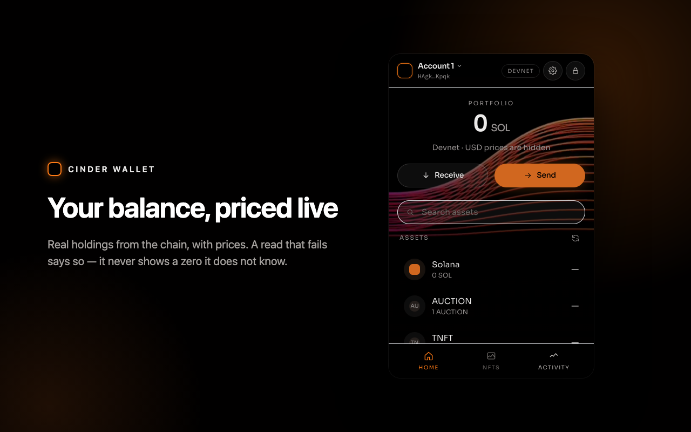
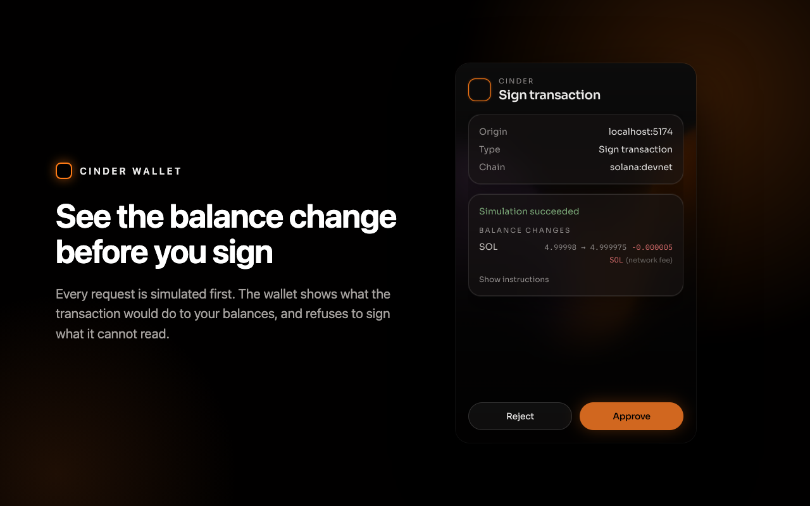
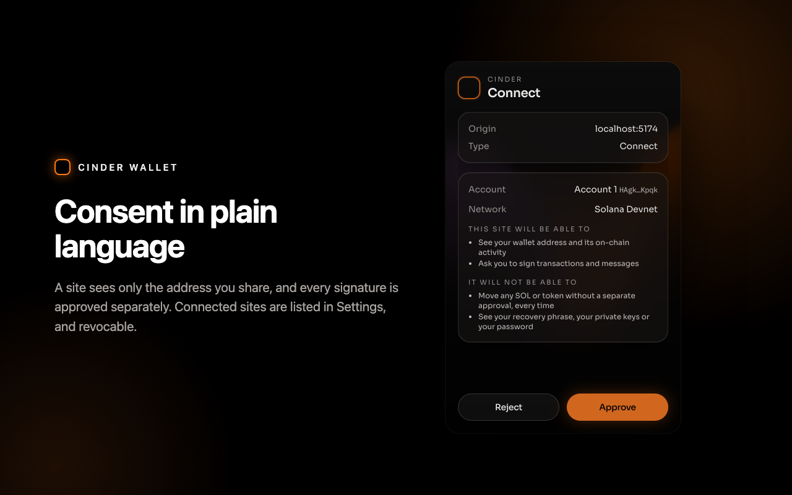
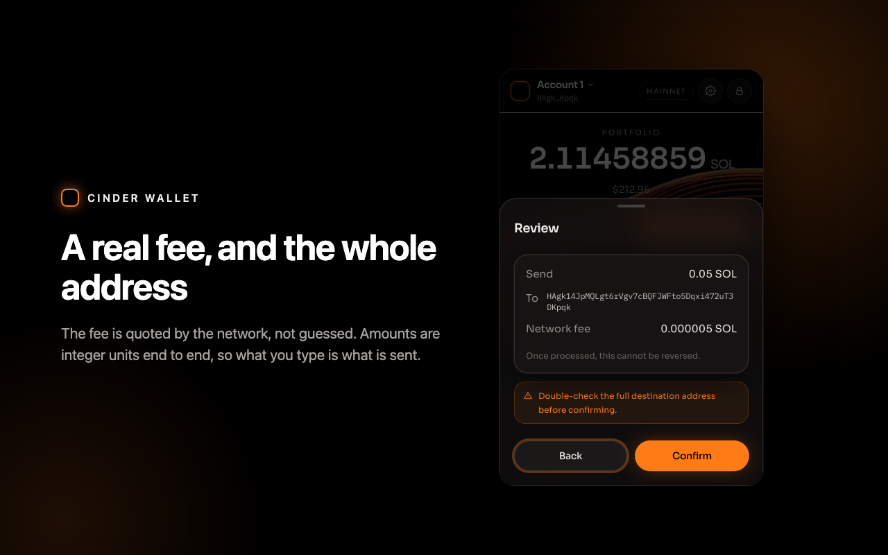

# Cinder Wallet

[](https://github.com/freyja-934/wallet-browser-extension/actions/workflows/check.yml)

Self-custodial Solana wallet for Chrome (Manifest V3). The encrypted keyring lives in the service worker — the popup never holds a `Keypair`. Sites talk [Wallet Standard](https://github.com/wallet-standard/wallet-standard), not a fake `window.solana`.

This is a portfolio implementation. It does not impersonate Phantom. It has not been audited. Do not put mainnet funds on it that you cannot lose.

<p align="center">
  
</p>
<p align="center">
  
  
  
</p>

## What this demonstrates

- MV3 service worker lifecycle and idle-based auto-lock (`chrome.alarms`)
- BIP39 → BIP44 `m/44'/501'/n'/0'` derivation (`mnemonicToSeed`, not `Buffer.from(mnemonic)`)
- Wallet Standard: `standard:connect` (with `silent`), `standard:disconnect`, `standard:events`, `solana:signTransaction`, `solana:signAndSendTransaction`, `solana:signMessage`. Each account's `chains` is the active cluster and is re-stamped on a cluster change, so wallet-adapter can send on either.
  - N inputs to one `signTransaction` or `signMessage` call (at most 10, and at most 256 KiB in total) are one approval window and N outputs in order; `signAndSendTransaction` takes exactly one transaction per call, forwards `skipPreflight`, `preflightCommitment`, `maxRetries` and `minContextSlot`, and waits for `commitment` for at most 30 s.
  - `signMessage` refuses bytes that decode as a serialized transaction message — such a signature would be a valid transaction signature.
  - The `account` input picks the signer: its address is resolved to a derivation index against the wallet's own accounts inside the worker (a page names an address, never an index) and pinned to the approval, so the key that signs is the one the approval window names; an address this wallet does not hold is refused, and switching the active account rejects an approval bound to another one.
- Vault v2: the blob carries its own version and KDF parameters, PBKDF2-SHA256 at OWASP's 600,000 iterations with AES-256-GCM. A v1 blob (unversioned, 100k) is re-encrypted on the next successful unlock, written before anything else in that unlock; a blob this build cannot read is refused as `Unsupported vault format` rather than reported as a wrong password. See `docs/adr/0002-vault-v2.md`.
- Multiple accounts: add (next `m/44'/501'/n'/0'`), rename, switch. Accounts are looked up by derivation index, never by position, list writes are serialised in the worker, and the list survives a lock.
- Per-origin trust: connect once, revoke in Settings; the full approval lifecycle (window close, page timeout, revoke, lock) with `change` events pushed to connected pages.
- Legacy and v0 transactions, with address lookup tables resolved in the preview.
- Simulation preview: a balance diff (SOL and tokens, before → after) from `simulateTransaction` pinned to the slot of the account read, program names, `setAuthority` and approve warnings, unknown programs. Approve is disabled while the preview is unsettled, when an instruction is unreadable, or when the active account is not a required signer.

## Architecture

```
Page → injected provider (MAIN world, Wallet Standard)
     → content script (allowlisted message types, origin from the browser)
     → service worker: router.ts, one arm per protocol.ts request type
     → keyring (the only place a Keypair exists)

Popup / approval window → chrome.runtime.sendMessage → the same router
Worker → connected pages → chrome.tabs.sendMessage → standard:events `change`
         (lock, disconnect, revoke, account change, cluster change)

Vault (v2): PBKDF2-SHA256 600k + AES-256-GCM in chrome.storage.local; the blob carries its own version and KDF parameters
Session:    chrome.storage.session, cleared when the browser closes; no local fallback
Origins:    connected sites in chrome.storage.local (Settings → Connected sites → Revoke)
Popup state: Redux for lock / accounts / modals, React Query for everything read from a chain
```

The content script never forwards a page's payload into the worker message: it honours the outer `type` and rebuilds the message field by field from the fields that type accepts, and the origin is the browser's view of the sender, never a value the page supplied. The worker validates every request against `protocol.ts` at the boundary and every response against that request's own response type.

A site must be approved once (Connect) before it can read the address or ask for a signature. A connected site's later `connect()` answers without a window, `connect({ silent: true })` never prompts, and a request from a site that never connected is refused with `Not connected`. One request per site is pending at a time; closing the approval window or the site's tab rejects it, the page withdraws it shortly before its own 120 s timeout, disconnecting or revoking rejects it, the worker expires anything older than 5 minutes, and locking rejects everything queued. Approve claims a request before signing, so whatever is broadcast is what the site is told about, and a page can only poll or cancel its own request. A connect or sign while locked opens the approval window with the unlock form inside it. There is no keep-alive port: the worker wakes per message and pending approvals survive in `chrome.storage.session`.

The toolbar popup is **380×600** (Chrome caps action popups at 600px). Approvals open `approve.html` via `chrome.windows.create`, never `chrome.action.openPopup()`.

## What you get, with and without an RPC key

Cinder ships with no API key — a key in a Chrome Web Store zip is a key anyone can extract. The endpoint list comes from Settings, not the build, and what the wallet can show depends on what that endpoint serves.

| | Store build, nothing configured | With your own RPC URL or Helius key in Settings |
|---|---|---|
| SOL balance, send, receive | yes | yes |
| Transaction history | yes (decoded on-chain) | yes, enriched |
| USD prices | yes (CoinGecko) | yes |
| SPL and Token-2022 balances | yes — `getTokenAccountsByOwner` is refused, so the mints come from Jupiter and every number from the chain | yes |
| Token names and logos | yes, from Jupiter's token list, with on-chain metadata behind it (read ten mints a call, which is what the public endpoint takes) | yes |
| NFTs | **no** on Mainnet — needs DAS; yes on Devnet | yes |
| dApp connect, sign, simulation preview | yes | yes |

How the keyless token list works, since the table's first column changed: no free Mainnet endpoint will enumerate a wallet's token accounts — publicnode answers `getTokenAccountsByOwner` with `-32602 Request blocked` — so with nothing configured Cinder asks Jupiter's free public API *which mints* an address holds, and what they are called. It then makes two reads of its own through the normal rotated connection, both batched at ten (publicnode's measured cap on `getMultipleAccounts`: ten answer in 195 ms, eleven stall three seconds and fail): the mints' own accounts, for `decimals` and the token program, and then your associated token account of each mint, for the amount it holds. **Jupiter supplies discovery and cosmetics; every number you act on is read from the chain.** That is not a detail — the decimals a row displays are what the send screen converts your typed amount with, and the balance beside them is what Max fills in, so Jupiter's own amount is used for nothing but deciding which mints to ask the chain about. A holding neither read confirms is dropped from the list rather than guessed at, and the popup says how many — separately from the ones past the 200 mints one refresh reads, which it never asked about and does not pretend to have. The known gap: a balance you keep in a token account that is not the associated one is counted as unconfirmed rather than shown, because it is not a balance a send from here could move. The price is real and is disclosed: on a keyless Mainnet install, `lite-api.jup.ag` sees your address. Entering any RPC URL or a Helius key in Settings turns it off entirely, and it is never used on Devnet. See [ADR 0004](docs/adr/0004-keyless-token-discovery.md).

Keyless Mainnet has exactly one default, `https://solana-rpc.publicnode.com`. The obvious alternative is not there: `https://api.mainnet-beta.solana.com` returns 403 to any request carrying an `Origin` header — which every extension request does — so it could not serve a single call from here, and it is in neither the endpoint list nor the manifest. publicnode publishes CORS headers that accept a browser origin, and it serves no DAS and refuses `getTokenAccountsByOwner` — measured, not assumed: `-32602 Request blocked` and `-32601` respectively, from a real extension origin (see [ADR 0003](docs/adr/0003-keyless-mainnet-endpoint.md) and [ADR 0004](docs/adr/0004-keyless-token-discovery.md)). That is what the token paragraph above works around, and what leaves NFTs where they are. Devnet's public host serves both, so Devnet is still the full-feature demo.

Where a read is not available, the popup says so: NFTs (and tokens, when the keyless fallback cannot help either) show "add an RPC endpoint in Settings", a failed read shows an error card with Retry, and the portfolio figure is marked `· SOL only`. A list that did come from the keyless fallback says so under itself, along with how many holdings the chain would not confirm and, separately, how many were past the number one refresh reads. It never shows a zero balance it does not know.

Settings → RPC takes a custom HTTPS URL (probed with `getHealth` and `getGenesisHash`, and only used on the cluster it answered for) and a Helius API key. Both are stored in `chrome.storage.local` on that device and are never sent anywhere but the endpoint itself. A custom host outside the manifest is granted through `optional_host_permissions` at the moment you click Save. The order tried is custom URL, then Helius, then the public defaults.

Endpoint rotation, in one paragraph: HTTP 401/403 and a refused method (JSON-RPC `-32601`, `-32010`, `-32011`, or a message saying the method is unsupported or key-gated) skip to the next endpoint for that call only; 408/429/5xx, transport errors and node-health codes rest that endpoint for 30 s; any other JSON-RPC error is returned at once, because every endpoint would say the same. Balances stay fresh for 30 s, NFTs and history for 60 s, on-chain names for 5 min; switching account, cluster or endpoint shows a loading state rather than the previous scope's numbers.

What that rotation can and cannot do, said plainly: the mechanism is real — cooldowns, health marking and reordering, all of it in `src/lib/rpc-rotate.ts` and covered by `src/lib/rpc-rotate.test.ts` — but on keyless Mainnet the public list has exactly one entry, so there is nothing to fail over *to*. When publicnode is down or blocked, the rotation runs out of URLs and the popup says no endpoint is reachable. Failover starts to mean something only once you add your own URL or a Helius key, which are tried ahead of the public default. A second public host is not shipped on purpose: every host in that list receives the addresses you look up and the transactions you sign, so it is a decision about who receives your data rather than a free redundancy win.

## Known limitations

- **Localnet is not supported.** wallet-adapter maps a localhost endpoint to `solana:localnet`, and the wallet lists only `solana:mainnet` and `solana:devnet`. A request naming another chain is refused with "Cinder is on Devnet; switch networks in Settings". `just dapp` runs on devnet.
- **Keyless Mainnet has no NFTs.** Listing what a wallet holds takes the DAS API, no free endpoint serves it, and Metaplex retired the free Aura endpoints — the hostnames are NXDOMAIN on public resolvers. The only remaining candidate is a marketplace's own ownership index, which is a different trust class from reading the chain, so the empty state says collectibles need an endpoint of your own instead. Tokens, unlike NFTs, do have an honest keyless path; see ADR 0004.
- **A keyless token row cannot spend a non-canonical token account.** Jupiter returns a mint and an amount, not an account, so such a row carries no source and the send derives the associated token address. A balance held somewhere else will display and then fail at send with "source not found" rather than spend from an account you did not mean. With your own endpoint the token accounts are enumerated and this does not arise.
- **A keyless refresh confirms at most 200 mints.** Each ten cost a round trip through the single public host, and wallets holding thousands of airdropped mints are real. Whatever is past the cap, or whose mint account could not be read, is counted under the list rather than dropped in silence.
- **Keyless Mainnet rests on one third-party host.** publicnode is goodwill, provided AS IS with unpublished limits, and it is verified rather than assumed: on 2026-09-14 `E2E_LIVE_MAINNET=1 just e2e e2e/rpc.spec.ts` passed from a `chrome-extension://` origin (a `getHealth` 200), and `CINDER_OUT_DIR=dist-store node scripts/probe-mainnet-rpcs.mjs` read a real Mainnet balance through it from the shipping `just store` build with no key set. The one-host list is a decision, not an oversight — the rest of the free field either refuses a browser origin, demands a key, or would cost a shared credential this wallet is not willing to spend quietly; the provider-by-provider survey is in [`docs/adr/0003-keyless-mainnet-endpoint.md`](docs/adr/0003-keyless-mainnet-endpoint.md), and `node scripts/probe-mainnet-rpcs.mjs` re-runs it from a real extension origin. When no endpoint answers, the popup says so and asks you to add one in Settings rather than showing a zero — if Mainnet looks dead on your network, check that first.
- **Connecting a site shares every account, including ones created later.** The
  connect screen says so, and each signature is still approved separately and
  signed by the account the request names. But a second account added after the
  connect is pushed to sites connected earlier in a `change` event, with no
  fresh prompt, which links the two addresses for anyone watching that dApp.
  Revoke the site in Settings if that matters to you. Per-origin account scoping
  is recorded but not enforced; narrowing it is a permission-model change, not a
  bug fix.
- **Chrome 111 or later.** The Wallet Standard provider is a MAIN-world content script, which is what that version added. There is no Firefox build.
- **No hardware wallets, swaps, staking, NFT transfers, or token-approval management.** Send covers SOL and SPL / Token-2022 tokens.
- **Not audited.** The vault, the origin model and the approval lifecycle have unit and end-to-end tests, and no third-party review.

## Load unpacked

```bash
pnpm install     # or: just setup
cp .env.example .env   # required — without it the build is Mainnet
just ext         # or: pnpm build:extension
```

`.env` is gitignored, so a fresh clone has none, and `VITE_NETWORK` then falls back to its default: **Mainnet**. Copying `.env.example` is what makes `dist/` the `VITE_NETWORK=devnet` build the steps below, the test wallet and `just e2e` all assume. Rebuild with `just ext` after any change to `.env`.

1. Open `chrome://extensions`
2. Enable Developer mode
3. Load unpacked → select `dist/`
4. Run `just dapp` and open http://localhost:5174 (`file://` will not inject the provider — and the dApp reads the same `.env`, so it is on Devnet too)
5. Connect → Sign message → Sign v0 transfer (approval window + simulation preview)

Check the network pill in the popup before you do anything with funds: it names the cluster the build was compiled for. `just store` builds Mainnet into `dist-store/` instead, so the unpacked extension you have loaded never changes network underneath you.

Optional: set `VITE_HELIUS_API_KEY` in that `.env` to seed the Settings field during development. Never commit an API key; `just store` refuses to zip a build that contains one.

## Commands

```bash
just setup      # pnpm install
just check      # tsc + lint + vitest run — the gate
just ext        # build the loadable extension into dist/ (the cluster comes from .env; Mainnet if there is none)
just dapp       # http://localhost:5174 Wallet Standard test dApp
just e2e        # build, then Playwright Chromium against the real extension
just store      # mainnet zip for the Chrome Web Store into dist-store/ (does not submit)
```

`CINDER_OUT_DIR` overrides the output directory of `just ext` (`just store` sets it to `dist-store`).

`pnpm exec vitest run --coverage` runs the same suite with a 94 percent lines threshold over
`src/background/`, `src/content/` and `src/lib/`. It is separate from `just check` because the
threshold is a whole-suite figure and `just test <file>` is a narrow run; see `docs/README.md`.

Privacy and terms: `docs/legal/` (the same text ships as `legal/privacy.html` and `legal/terms.html`). Chrome Web Store paste: `docs/store/listing.md`. Docs map: `docs/README.md`. Release notes: `CHANGELOG.md`.

## Extension e2e

- `just e2e` loads Cinder Wallet into Playwright's bundled Chromium (`channel: 'chromium'`), not branded Google Chrome, which removed `--load-extension`.
- It builds `dist/` first and the suite assumes Devnet, so `.env` must exist with `VITE_NETWORK=devnet` (`cp .env.example .env`) or set `VITE_NETWORK=devnet` in the environment. A Mainnet `dist/` fails the suite rather than spending real funds.
- First time: `pnpm exec playwright install chromium`
- A full run spends 10000 lamports of the devnet fixture: two fee-only self-transfers (the dApp `signAndSend` approval and the popup send). Nothing leaves the address; top it up at https://faucet.solana.com when it runs low.
- A funded fixture runs everything; an empty one **skips** the six tests that need funds (the four in `e2e/send.spec.ts` and the two `signAndSend` cases in `e2e/dapp.spec.ts`), naming the address, the balance and the shortfall. Nothing is retried and no assertion is relaxed — the fixture is a public address bots sweep, so an empty one is a faucet fact, not a wallet bug. See `docs/test-wallet.md`.
- Coverage: import / unlock, dashboard tabs, create-new with the seed quiz, a second `CREATE_WALLET` against an existing vault refused rather than replacing it, Send → Review (junk address, Max as balance minus the priced fee, the decimals error, the fee row) and one confirmed 0.001 SOL devnet self-transfer, settings auto-lock / export seed / change password, add / switch / rename a second account surviving a lock, Receive copy (the address handed to `navigator.clipboard.writeText`, which the spec stubs — the real clipboard write is a manual check), dApp connect / sign-message / sign-v0, two transactions in one call, cluster switch re-stamping `chains`, wrong-chain refusal, transaction-as-message refusal, a page trying to override the bridged message type, locked connect unlocking inside the approval window, `signAndSend` reject and a 0-lamport `signAndSend` approve, approval window close → reject, silent and repeat connect, Connected sites → Revoke, `Not connected` for a stranger, and lock → empty `change`.

## Chrome click-through (after Load unpacked)

1. Create a wallet, close the popup, reopen — you should see Unlock, not Create
2. Unlock, then `just dapp` → http://localhost:5174
3. Connect (approval window) → Sign message → Sign v0 transfer (simulation preview). Connect again: no window. Lock in the popup: the dApp log shows `change` with no accounts
4. In the popup, Receive → Copy should toast "Address copied" and paste back the full address — this is the one clipboard check no automated test can make, because the e2e drives the popup as a tab and stubs `navigator.clipboard`; Settings → Connected sites lists localhost:5174 with Revoke
5. Optional on **devnet only**: use the faucet if needed, then send a small amount of SOL or an SPL token. Activity should show the amount, not "On-chain".

## Security notes

- Not audited. Do not use this with mainnet funds you cannot lose
- Cinder registers under its own name only. It never sets `isPhantom` and never writes `window.phantom`
- An RPC key belongs in Settings, on the device. Nothing in the shipped build carries one, and `just store` refuses to zip a bundle that does

## License

MIT. See [LICENSE](LICENSE).
